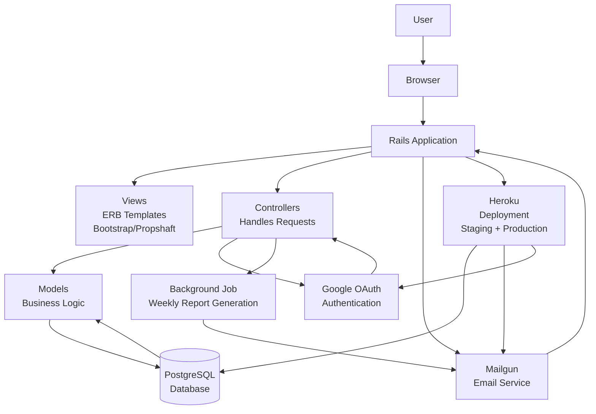
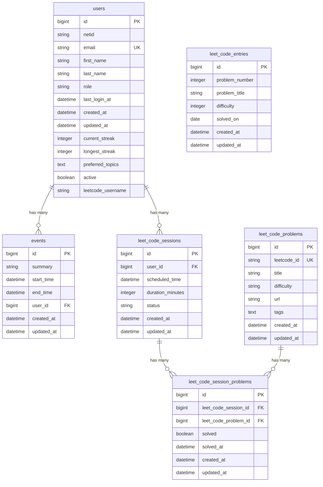

# System Architecture Diagrams

## 1. Overall System Architecture (System Architecture)



## 2. Database Schema (Database Schema)



## 3. Rails MVC Architecture (Rails MVC)

```mermaid
flowchart TD
    V[Views<br/>ERB Templates<br/>Bootstrap UI] --> C[Controllers<br/>UsersController<br/>SessionsController<br/>etc.]
    C --> M[Models<br/>User<br/>Event<br/>LeetCodeSession<br/>etc.]
    M --> DB[(PostgreSQL<br/>Database)]
    DB --> M
    C --> Mailer[WeeklyReportMailer<br/>Sends Emails]
    Mailer --> Mail[Mailgun<br/>Email Service]
    C --> Auth[Google OAuth<br/>Authentication Service]
    Auth --> C
    C --> Job[Background Jobs<br/>Weekly Report Task<br/>lib/tasks/weekly_report.rake]
    Job --> Mailer
    V --> C
    C --> V